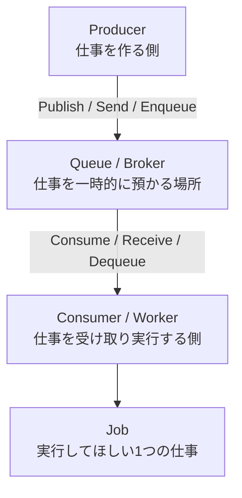

[← 目次に戻る](../../README.md)

# 1. まず全体像

非同期処理の登場人物は、たった5つです。

```text
Producer
  ↓
Queue / Broker
  ↓
Consumer / Worker
  ↓
Jobを実行
```



## 用語の意味（まずはざっくり）

| 用語 | ひとことで | 身近なたとえ |
|---|---|---|
| **Producer** | 仕事を**作る**側 | 注文を出すお客さん |
| **Queue** | 仕事を**一時的に預かる**場所 | 注文伝票を刺しておくレール |
| **Consumer** | 仕事を**受け取る**側 | 伝票を取りに行く人 |
| **Worker** | 仕事を**実際に実行する**プロセス | 調理する料理人 |
| **Job** | 実行してほしい**1つの仕事** | 伝票1枚（「カレー1つ」） |

## ⚠️ 注意：Consumer と Worker は完全な同義ではない

初学者向けの説明では「Consumer ≒ Worker」で構いませんが、厳密には**役割の切り口が違います**。

* **Consumer** … 「Queue/Brokerから**メッセージを受け取る**」という**通信上の役割**を指す言葉。Brokerから見た相手側。
* **Worker** … 「受け取った仕事を**実際に処理する**」という**実行主体（プロセス / スレッド / goroutine）** を指す言葉。

```text
1プロセスの中に、
  Consumer（受け取る部分）と Worker（処理する部分）が両方いる
        ↓
だから「同じもの」に見えることが多い
```

分かれるケースもあります。

```text
[ 1つのConsumerプロセス ]
      │ Queueから1件受け取る
      ↓
 ┌────┼────┬────┐
 ↓    ↓    ↓    ↓
W1   W2   W3   W4      ← プロセス内のWorker（スレッド / goroutine）
```

> 💡 **ポイント**
> 「Consumer = 受け取る役」「Worker = 実行する役」。
> **1つのConsumerが複数のWorkerを抱える構成もある**ので、文脈によって指すものが変わります。
> 逆に「Workerプロセス」と言うとき、Consumerの機能も含めて呼んでいることがほとんどです。

---

| 前 | 目次 | 次 |
|:--|:--:|--:|
| — | [📖 目次](../../README.md) | [2. Jobとは何か →](02-job.md) |
