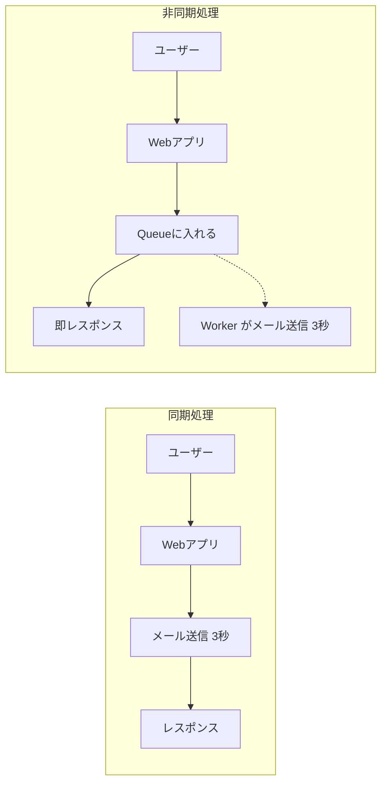

[← 目次に戻る](../../README.md)

# 3. Queueとは何か

> **Queue = 仕事を待たせておく場所**

Producerが作ったJobを、Workerが取りに来るまで**預かっておく入れ物**です。

```text
Producer
   ↓
┌─────────────────┐
│ Queue           │
│                 │
│ Job #003        │
│ Job #002        │
│ Job #001        │  ← 先に入ったものから取り出される（FIFO が基本）
└─────────────────┘
   ↓
Worker
```

Queueは基本的に **FIFO（First In, First Out / 先入れ先出し）**、つまり「先に並んだ人から処理される」レジの行列のイメージです。

> ⚠️ **注意**
> 「基本はFIFO」ですが、**厳密な順序を保証するかは製品や設定によって違います**。
> 複数Workerが並列で取り出す時点で、**完了する順番はバラバラ**になります。
> 「順序が絶対に必要」な処理は、設計時に明示的に考える必要があります。

## 同期処理と非同期処理

これがQueueを使う一番の理由です。

**同期処理**：呼び出した側が、処理が終わるまで待つ

```text
ユーザー ──リクエスト──▶ Webアプリ
                          │
                          │ メール送信（3秒）
                          │ ......待つ......
                          ▼
ユーザー ◀──レスポンス──  完了

合計: 3秒以上ユーザーを待たせる
```

**非同期処理**：仕事をQueueに預けて、すぐ返す

```text
ユーザー ──リクエスト──▶ Webアプリ
                          │
                          │ QueueにJobを入れる（0.01秒）
                          ▼
ユーザー ◀──レスポンス──  「受け付けました」

                        （裏で）Worker がメール送信（3秒）

合計: ユーザーの体感は 0.01秒
```



## なぜQueueが必要なのか（3つの理由）

1. **速さ**：ユーザーを待たせない（レスポンスを即返せる）
2. **耐障害性**：メールサーバーが落ちていても、Jobは消えずにQueueに残る → 復旧後に処理できる
3. **平準化（バッファ）**：一時的に大量のリクエストが来ても、Queueが受け止め、Workerが自分のペースで処理する

```text
   リクエストが急増             Queueが受け止める        Workerは一定ペース
  ▁▂▃▅█████▅▃▂▁      →     [ たまる ]      →      ▃▃▃▃▃▃▃▃▃▃▃
```

> 💡 **ポイント**
> Queueは「速くするための道具」であると同時に、「**壊れにくくするための道具**」でもあります。

---

| 前 | 目次 | 次 |
|:--|:--:|--:|
| [← 2. Jobとは何か](02-job.md) | [📖 目次](../../README.md) | [4. Producer / Consumer →](04-producer-consumer.md) |
