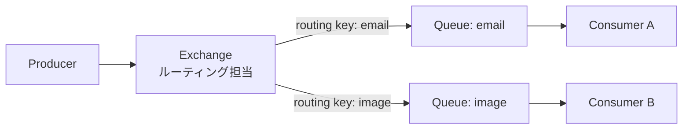
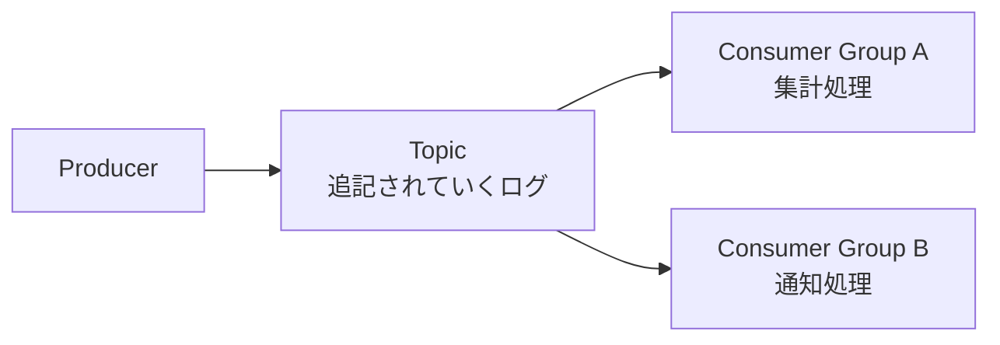

[← 目次に戻る](../../README.md)

# 5. RabbitMQ / Kafka / SQS（それぞれ何が違うのか）

> ⚠️ **注意**
> 「RabbitMQもKafkaもSQSも、全部Queueでしょ？」——これは**雑すぎる理解**です。
> 目的も設計思想も違います。

## 比較表

| 技術 | ざっくり何か | Producer側 | Consumer側 | 特徴 |
|---|---|---|---|---|
| **RabbitMQ** | メッセージブローカー | MessageをPublish | Consumeして**Ack** | 柔軟なルーティング。処理したら**消える**のが基本 |
| **Kafka** | イベントストリーミング基盤 | EventをTopicへPublish | Offsetを進めながらPoll | **ログとして残る**。複数Consumerが同じデータを読める |
| **SQS** | マネージドメッセージキュー | MessageをSend | ReceiveしてDelete | AWS任せで運用が楽。サーバー管理不要 |
| **Redis** | データストア。Queue用途にも利用可能 | Pushなど | Popなど | 速い。専用製品ではないので機能は限定的 |
| **DB** | 本来はデータベース | jobsテーブルなどへINSERT | SELECT → UPDATE | 追加インフラ不要。既存の仕組みで完結 |

## RabbitMQ：Exchange が間に入る

```text
Producer
 ↓
Exchange     ← 「どのQueueに配るか」を決める交換機
 ↓
Queue
 ↓
Consumer
```



RabbitMQの特徴は、Producerが**Queueに直接送らない**ことです。
一度 **Exchange** に送り、Exchangeが「ルーティングキー」を見て、どのQueueに入れるかを決めます。

> 💡 「メールJobはこのQueue、画像JobはあのQueue」といった**振り分けが柔軟**なのがRabbitMQの強みです。

## Kafka：Topic に「ログとして積む」

```text
Producer
 ↓
Topic
 ↓
Consumer
```



Kafkaは「取り出したら消える箱」ではなく、「**追記され続けるログ**」です。
Consumerは「自分がどこまで読んだか（**Offset**）」を覚えながら読み進めます。

```text
Topic の中身（消えない）
[ E1 ][ E2 ][ E3 ][ E4 ][ E5 ][ E6 ] ...
              ▲                 ▲
       GroupA: ここまで読んだ    GroupB: ここまで読んだ
```

> 💡 **同じデータを複数の用途で読める**のがKafkaの本質です。
> 「Job Queue」というより「**イベントの流れを扱う基盤**」と捉えるほうが正確です。

## SQS：シンプルなマネージドQueue

```text
Producer
 ↓
SQS Queue
 ↓
Worker
```

AWSが運用してくれるので、**サーバーを立てなくていい**のが最大の利点です。
「Visibility Timeout（取り出したメッセージを一定時間他から見えなくする）」という仕組みで、重複処理を減らします（→ 第7章）。

## 💡 どれを選ぶか（ざっくりの指針）

```text
とりあえず非同期にしたい／規模が小さい     → DB Queue or Redis
柔軟な振り分けが欲しい                    → RabbitMQ
イベントを複数システムで共有・再処理したい → Kafka
AWSを使っていて運用を減らしたい            → SQS
```

> ⚠️ **注意**
> 最初から Kafka を選ぶ必要はほとんどありません。
> **「まずDB Queue、足りなくなったら専用製品」** で十分なケースが大多数です。

---

| 前 | 目次 | 次 |
|:--|:--:|--:|
| [← 4. Producer / Consumer](../part1-basics/04-producer-consumer.md) | [📖 目次](../../README.md) | [6. DBをQueueとして使う →](06-db-as-queue.md) |
