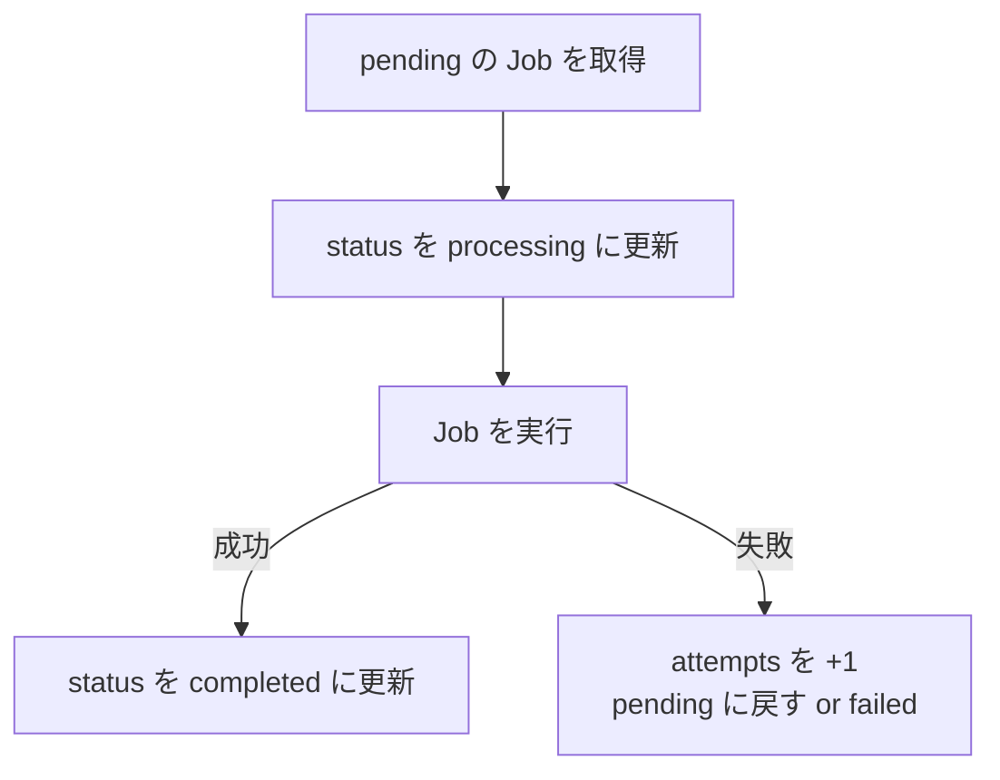

[← 目次に戻る](../../README.md)

# 6. DBをQueueとして使う

> ⚠️ **よくある誤解**
> 「Queue = Redis や RabbitMQ などの専用製品」——**限定しないでください**。
> **RDB（MySQL / PostgreSQL）のテーブルをQueueとして使う設計は、ごく一般的**です。

## イメージ

```text
jobs
----------------------
id | status
1  | pending
2  | pending
3  | pending
```

実際のテーブル例：

```sql
CREATE TABLE jobs (
    id          BIGSERIAL PRIMARY KEY,
    type        VARCHAR(50)  NOT NULL,   -- 'send_email' など
    payload     JSON         NOT NULL,   -- 処理に必要なデータ
    status      VARCHAR(20)  NOT NULL,   -- pending / processing / completed / failed
    attempts    INT          NOT NULL DEFAULT 0,
    created_at  TIMESTAMP    NOT NULL
);
```

## Producer側：INSERTするだけ

```sql
INSERT INTO jobs (...)
VALUES (...);
```

## Worker側：取り出して、処理して、更新する

```text
pendingのJobを取得
 ↓
処理
 ↓
completedへ更新
```



## なぜDB Queueを使うのか

| メリット | 説明 |
|---|---|
| **インフラが増えない** | RedisもRabbitMQも立てなくていい |
| **トランザクションと一体にできる** | 「注文をINSERT」と「Jobを登録」を**同じトランザクション**にできる（← これが大きい） |
| **中身が見える** | SQLで「今どのJobが詰まっているか」をすぐ調べられる |
| **運用が楽** | DBのバックアップにJobも含まれる |

> 💡 **ポイント：トランザクションと一体にできる利点**
>
> ```text
> BEGIN
>   INSERT INTO orders ...     -- 注文を保存
>   INSERT INTO jobs ...       -- 「確認メールを送る」Jobを登録
> COMMIT
> ```
>
> こうすると「**注文は保存されたのにメールJobが登録されていない**」という不整合が起きません。
> 外部のQueue製品を使うと、この2つは別々の仕組みになるため、整合性を保つ工夫（Outboxパターンなど）が必要になります。

## ⚠️ デメリット

| デメリット | 説明 |
|---|---|
| **DBに負荷がかかる** | Workerが常にポーリング（SELECT）し続ける |
| **スループットの限界** | 秒間数万件のような規模には向かない |
| **専用機能がない** | 遅延実行・優先度・再試行などは自分で実装する必要がある |

## 各言語での位置づけ

> ⚠️ **注意（Goについての正確な表現）**
>
> * ❌ **「GoだからDB Queueを使う」** … これは誤り。Goに専用Queueがないわけではありません。
> * ✅ **「GoでもDBをQueueとして利用する設計は可能」** … これが正確。
>
> DB Queueは**言語の特性ではなく、設計の選択**です。
> Python・Java・Laravel・Go、**どの言語でもDB Queueは実装できます**し、実際に使われています。
> （Laravelには `database` ドライバが標準で用意されており、設定1つで DB Queue になります）

---

| 前 | 目次 | 次 |
|:--|:--:|--:|
| [← 5. RabbitMQ / Kafka / SQS](05-brokers.md) | [📖 目次](../../README.md) | [7. 複数Workerと重複実行問題 →](../part3-concurrency/07-duplicate-execution.md) |
