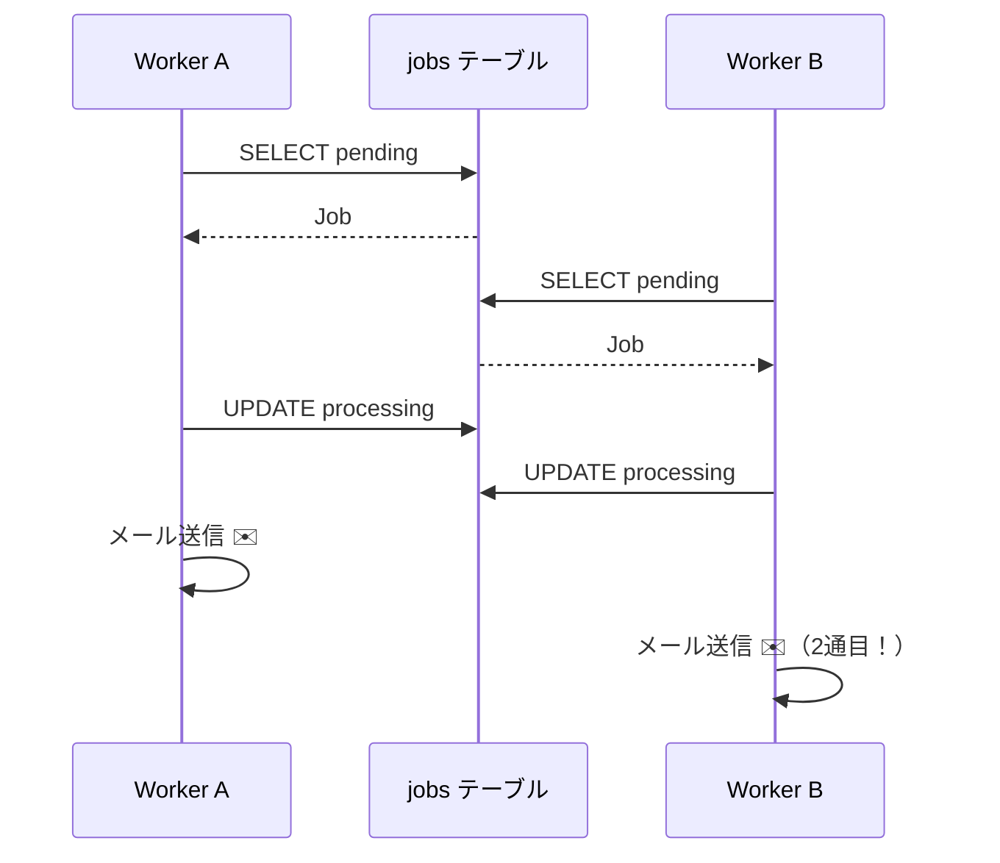

[← 目次に戻る](../../README.md)

# 7. 複数Workerと重複実行問題

ここが**この資料で一番重要な章**です。

Jobが溜まってきたら、当然「Workerを増やそう」と考えます。

```text
              Queue
                │
        ┌───────┴───────┐
        ↓               ↓
     Worker A        Worker B
        │               │
        └───────┬───────┘
                ↓
            Job #123
```

## 何が起きるのか

Worker A と Worker B が、**ほぼ同時に**「pendingのJobをください」とQueueに聞きに行ったとします。

```text
時刻    Worker A                        Worker B
----------------------------------------------------------
t1      SELECT ... WHERE status='pending'
        → Job #123 を取得
t2                                      SELECT ... WHERE status='pending'
                                        → Job #123 を取得  ← まだpendingのまま！
t3      status を processing に更新
t4                                      status を processing に更新
t5      メール送信                       メール送信
```

結果：

```text
Worker A → メール送信
Worker B → メール送信
```



**ユーザーには同じメールが2通届きます。**

これは「Race Condition（競合状態）」と呼ばれる、並行処理の典型的なバグです。

## ⚠️ なぜ起きるのか：「確認」と「確保」が分かれているから

```text
1. 確認する （SELECT: 空いてる？）
       ↓
    ★ ここに"すき間"がある ★     ← 他のWorkerが割り込める
       ↓
2. 確保する （UPDATE: じゃあ私がやる）
```

この**すき間（time-of-check to time-of-use）** がある限り、必ず重複は起こり得ます。
Workerが2つでも、100個でも、原理は同じです。

## 💡 これはDB Queueだけの問題ではない

専用Queue製品も、この問題に対する**それぞれの答え**を持っています。

| 製品 | 重複を防ぐ仕組み |
|---|---|
| RabbitMQ | 1メッセージは1Consumerにのみ配信。Ackされるまで保持し、Ackがなければ再配信 |
| SQS | Visibility Timeout（取り出した瞬間、一定時間他から見えなくなる） |
| Kafka | 1パーティションは1Consumer Groupの1Consumerだけが読む |
| DB Queue | **自分で作る必要がある** ← 次章 |

> ⚠️ **重要**
> どの製品も「**絶対に1回だけ**」を保証しているわけではありません。
> 多くは「**At-least-once（少なくとも1回）**」——つまり**2回実行される可能性は残ります**。
> （例：Workerが処理完了直後・Ack送信前にクラッシュ → 再配信される）
> だからこそ、後の章の「冪等性」が必要になります。

## 🤔 では、どうやって同じJobを同時に処理しないようにするのか？

その答えが、次章の **排他制御** です。

---

| 前 | 目次 | 次 |
|:--|:--:|--:|
| [← 6. DBをQueueとして使う](../part2-queue-systems/06-db-as-queue.md) | [📖 目次](../../README.md) | [8. 排他制御 →](08-exclusive-control.md) |
