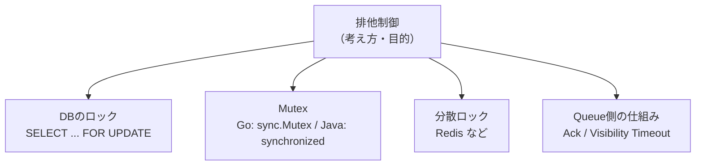

[← 目次に戻る](../../README.md)

# 8. 排他制御

> **排他制御 = 複数の処理が同じデータや資源を同時に操作することで発生する問題を防ぐ仕組み**

「排他」＝「他を排除する」。つまり「**同時に触らせない**」という考え方です。

## ⚠️ 「排他制御 = ロック」ではない

よくある誤解です。正しい関係はこうです。

> **排他制御という"考え方"の中に、ロックなどの"具体的な実装"がある**

```text
排他制御
├── DBのロック
│   └── SELECT ... FOR UPDATE
├── Mutex
│   └── Go: sync.Mutex
├── 分散ロック
│   └── Redisなど
└── Queue側の仕組み
```



> 💡 **ポイント**
> ロックは**手段のひとつ**にすぎません。
> 「排他制御したい」＝「常にロックを書く」ではなく、**Queue製品の仕組みで済むならそれが一番簡単**です。

## それぞれの守備範囲

ここが**選択を間違えやすい**ところです。

| 手段 | 守れる範囲 | 例 |
|---|---|---|
| **Mutex** | **同一プロセス内**だけ | Goの `sync.Mutex`、Javaの `synchronized` |
| **DBロック** | **同じDBを見る全プロセス・全サーバー** | `SELECT ... FOR UPDATE` |
| **分散ロック** | **同じRedis等を見る全プロセス・全サーバー** | Redis の `SET key value NX EX 30` |
| **Queueの仕組み** | Queue製品に任せる | Ack、Visibility Timeout |

```text
┌─────────── サーバー1 ───────────┐   ┌─────────── サーバー2 ───────────┐
│ ┌── プロセスA ──┐               │   │ ┌── プロセスC ──┐               │
│ │ goroutine 1  │               │   │ │ goroutine 1  │               │
│ │ goroutine 2  │ ← Mutexで守れる│   │ │ goroutine 2  │ ← Mutexで守れる│
│ └──────────────┘               │   │ └──────────────┘               │
└─────────────────────────────────┘   └─────────────────────────────────┘
        ↑                                       ↑
        └────── この2つの間は Mutex では守れない ──┘
                   → DBロック / 分散ロック が必要
```

> ⚠️ **注意**
> 「ローカルでは動いたのに、本番でサーバーを2台に増やしたら重複した」——
> これは **Mutexで守っていたつもりが、プロセスをまたげていなかった**、という典型的な事故です。

## DBロックによる解決：`FOR UPDATE SKIP LOCKED`

DB Queueで重複を防ぐ、現在の定番はこれです。

```sql
BEGIN;

SELECT id, payload
FROM jobs
WHERE status = 'pending'
ORDER BY id
LIMIT 1
FOR UPDATE SKIP LOCKED;   -- ★ ロック中の行は「飛ばして」次を見る

UPDATE jobs SET status = 'processing' WHERE id = ?;

COMMIT;
```

`SKIP LOCKED` があると、こうなります。

```text
Worker A: Job #123 を取得してロック
Worker B: Job #123 はロック中 → 待たずにスキップ → Job #124 を取得  ✅
```

`SKIP LOCKED` がないと、こうなります。

```text
Worker A: Job #123 を取得してロック
Worker B: Job #123 のロックが解けるまで待機 ... → 並列化の意味がない ❌
```

> 💡 **ポイント**
> `SKIP LOCKED` は「取り合いにならず、**空いている仕事から順に配る**」ための仕組みです。
> PostgreSQL 9.5+ / MySQL 8.0+ で使えます。
> （古いMySQLでは `UPDATE ... SET status='processing' WHERE status='pending' LIMIT 1` のような**更新の原子性**を使う方法が取られます）

## なぜ「排他制御」が必要なのか（まとめ）

```text
複数のWorkerを動かして速くしたい
        ↓
でも同じデータを同時に触ると壊れる
        ↓
「同時に触らせない」仕組みが要る  ← 排他制御
```

---

| 前 | 目次 | 次 |
|:--|:--:|--:|
| [← 7. 複数Workerと重複実行問題](07-duplicate-execution.md) | [📖 目次](../../README.md) | [9. Goの排他制御 →](09-go-mutex.md) |
