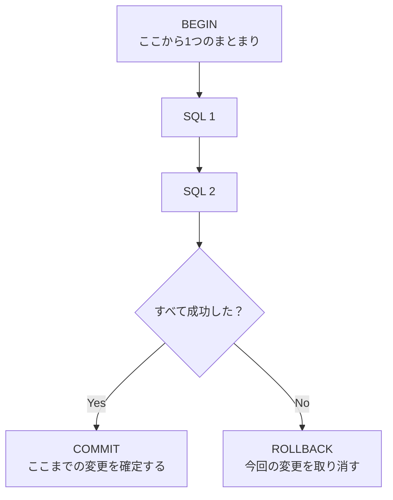

[← 目次に戻る](../../README.md)

# 10. トランザクション

> **トランザクション = 複数のDB操作を、ひとまとまりの処理として扱う仕組み**

「全部成功する」か「全部なかったことにする」か、**中途半端な状態を作らない**ための仕組みです。

## 基本の流れ

**成功する場合：**

```text
BEGIN
 ↓
SQL
 ↓
SQL
 ↓
COMMIT
```

**失敗する場合：**

```text
BEGIN
 ↓
SQL
 ↓
エラー
 ↓
ROLLBACK
```



## COMMIT と ROLLBACK

| 命令 | 意味 |
|---|---|
| **COMMIT** | **ここまでの変更を確定する**（他のトランザクションからも見えるようになる） |
| **ROLLBACK** | **今回の変更を取り消す**（BEGINの直前の状態に戻る） |

## なぜ必要なのか：具体例

「Aさんの口座から1000円引いて、Bさんの口座に1000円足す」

```text
❌ トランザクションなし
   UPDATE accounts SET balance = balance - 1000 WHERE id = 'A';  ← 成功
   ★ ここでサーバーがクラッシュ ★
   UPDATE accounts SET balance = balance + 1000 WHERE id = 'B';  ← 実行されない

   → 1000円が この世から消える 💸
```

```text
✅ トランザクションあり
   BEGIN;
     UPDATE accounts SET balance = balance - 1000 WHERE id = 'A';
     ★ ここでクラッシュ ★
   （COMMITされていない）

   → 自動的に ROLLBACK され、何もなかったことになる ✅
```

> 💡 **ポイント**
> トランザクションは「**中途半端な状態を絶対に作らない**」ための仕組みです。
> Job Queueでも「Jobをprocessingにする」「結果をDBに書く」といった複数操作をまとめるのに使います。

## 各言語での書き方（イメージだけ）

```python
# Python
with conn:                     # 正常終了でCOMMIT、例外でROLLBACK
    cur.execute("UPDATE ...")
```

```java
// Java (Spring)
@Transactional
public void transfer() { ... }   // 例外が出たら自動ROLLBACK
```

```php
// Laravel
DB::transaction(function () {
    // この中で例外が出たら自動ROLLBACK
});
```

```go
// Go
tx, _ := db.Begin()
defer tx.Rollback()        // COMMIT済みなら何も起きない
// ... SQL ...
tx.Commit()
```

> 💡 4つとも書き方は違いますが、やっていることは **BEGIN → 処理 → COMMIT / ROLLBACK** で同じです。

## ⚠️ 注意：トランザクションを長く持たない

```text
BEGIN
  UPDATE jobs SET status='processing' ...
  ★ 外部APIを呼ぶ（30秒かかる）★   ← ここが問題
COMMIT
```

トランザクション中は**ロックが保持され続けます**。
外部API呼び出しやメール送信のような「遅くて、失敗するかもしれない処理」は、**トランザクションの外**に出すのが原則です。

---

| 前 | 目次 | 次 |
|:--|:--:|--:|
| [← 9. Goの排他制御](../part3-concurrency/09-go-mutex.md) | [📖 目次](../../README.md) | [11. トランザクション分離レベル →](11-isolation-level.md) |
