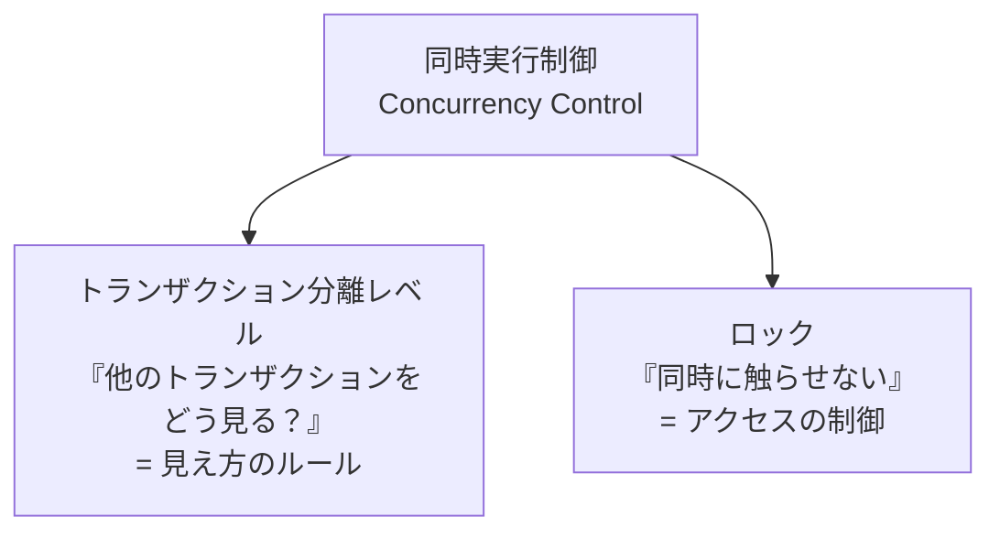
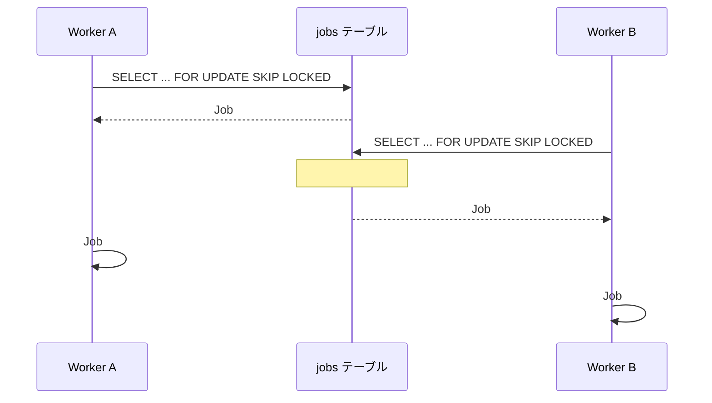

[← 目次に戻る](../../README.md)

# 12. 分離レベルとロックの違い

ここは**最も混同されやすいポイント**です。

## 別々の道具である

```text
同時実行制御
│
├── トランザクション分離レベル
│     「他のトランザクションをどう見る？」
│
└── ロック
      「同時に触らせない」
```



| | 分離レベル | ロック |
|---|---|---|
| 決めること | **どう見えるか**（可視性） | **触れるかどうか**（占有） |
| 対象 | 読み取り時の一貫性 | 特定の行・資源 |
| 設定単位 | トランザクション全体 | SQL文ごと（`FOR UPDATE` など） |
| たとえ | 「窓ガラス越しに何が見えるか」 | 「部屋のドアに鍵をかける」 |

## ⚠️ 最重要：分離レベルを上げても、Jobの重複取得は防げるとは限らない

> **分離レベルを上げれば、必ずJobの重複取得を防げるわけではありません。**

なぜか。分離レベルは「**読み取りの見え方**」のルールであって、「**2人が同じ行を取りに来たときにどちらかを止める**」仕組みではないからです。

```text
REPEATABLE READ にしても……

Worker A: SELECT ... WHERE status='pending' → Job #123 が見える
Worker B: SELECT ... WHERE status='pending' → Job #123 が見える  ← 止まらない！

（分離レベルは「読めた値の一貫性」は保証するが、
  「他人に読ませない」ことは保証しない）
```

SERIALIZABLE にすれば理論上は直列化されますが、

* 片方のトランザクションが**エラーで失敗する**（PostgreSQLの serialization failure など）
* → **アプリ側でリトライを実装する必要がある**
* → **性能が大きく落ちる**

という別のコストが発生します。Job Queueの取得のような**高頻度の処理**には向きません。

## ✅ Job Queueでの現実的な解

必要に応じて、**行ロックと組み合わせます**。

```sql
SELECT ...
FOR UPDATE SKIP LOCKED;
```

```sql
-- 実際の形
BEGIN;

SELECT id, type, payload
FROM jobs
WHERE status = 'pending'
ORDER BY id
LIMIT 10
FOR UPDATE SKIP LOCKED;   -- ★ 他Workerがロック中の行は飛ばす

UPDATE jobs
SET status = 'processing', attempts = attempts + 1
WHERE id IN (...);

COMMIT;
-- ↑ ここまでがJobの「確保」。実際の処理はCOMMIT後に行う
```



> 💡 **まとめ**
>
> ```text
> 「データの見え方を整える」   → 分離レベル
> 「取り合いを止める」         → ロック（FOR UPDATE SKIP LOCKED など）
> ```
>
> Job Queueの重複取得対策は、**分離レベルではなくロックの仕事**です。

---

| 前 | 目次 | 次 |
|:--|:--:|--:|
| [← 11. トランザクション分離レベル](11-isolation-level.md) | [📖 目次](../../README.md) | [13. 冪等性 →](../part5-reliability/13-idempotency.md) |
