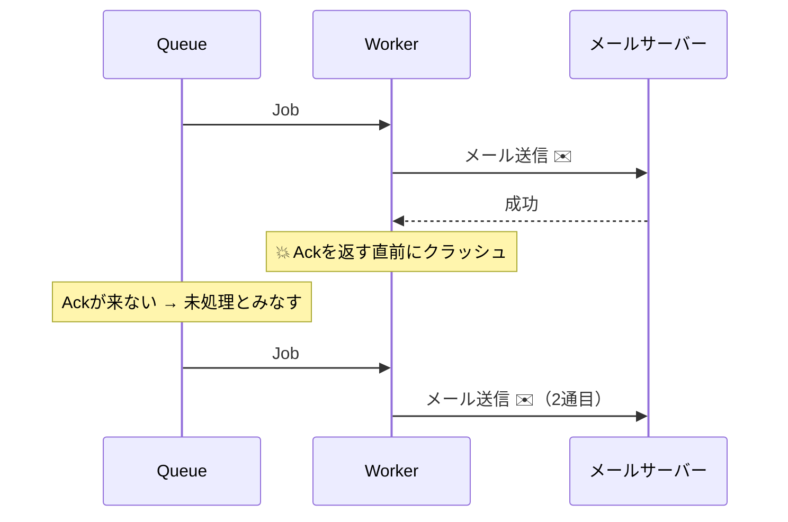
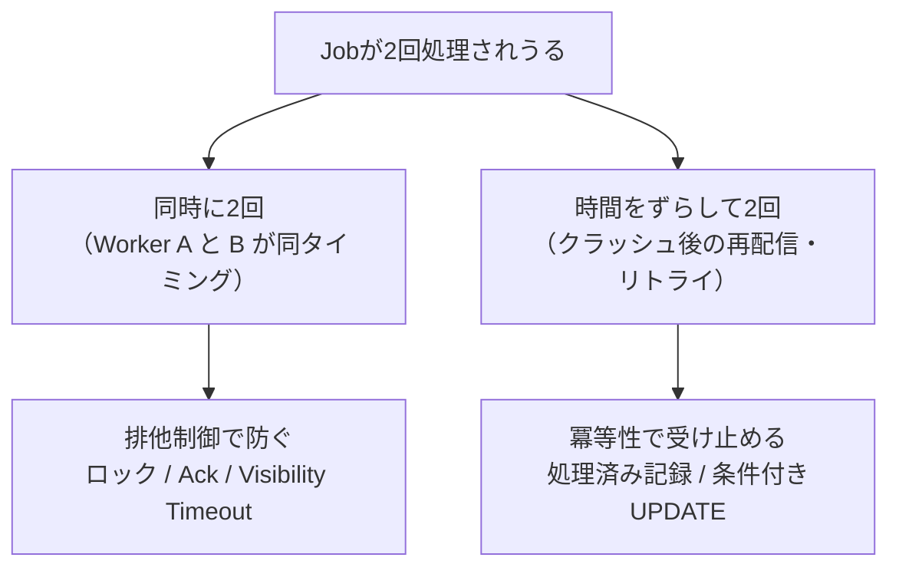

[← 目次に戻る](../../README.md)

# 13. 冪等性（Idempotency）

ここまでで排他制御を学びました。しかし——

> **排他制御だけでは十分ではありません。**

## なぜ十分ではないのか

排他制御は「**同時に**実行させない」仕組みです。
しかし「**時間をずらして2回**実行される」ことは防げません。

```text
Job #123
「メールを送る」
```

これが何らかの理由で2回実行された場合、

```text
メールが2通送られる
```

2回実行されてしまう、現実に起こるシナリオ：

| シナリオ | 何が起きるか |
|---|---|
| Workerが処理完了後・完了通知の直前にクラッシュ | Queueは「未完了」と判断 → 再配信 |
| ネットワーク断で Ack / Delete が届かなかった | 同上 |
| 処理がタイムアウト扱いになった（実は成功していた） | Visibility Timeout切れ → 別Workerへ再配信 |
| 失敗したと思ってリトライした（実は成功していた） | 2回目が走る |
| 運用でJobを手動で再実行した | 2回目が走る |



> ⚠️ **重要な現実**
> 多くのQueue製品の配信保証は **At-least-once（少なくとも1回）** です。
> 「Exactly-once（ちょうど1回）」を謳う仕組みもありますが、条件が限定的で、**分散システムでは完全な保証は非常に難しい**とされています。
> つまり、**「2回実行されることはある」という前提で設計するのが正解**です。

## 冪等性とは

> **同じJobが複数回実行されても、結果が壊れないように設計すること**

数学の「冪等（べきとう）」＝ 何回適用しても結果が同じ、という性質から来ています。

```text
1回実行 → 結果X
2回実行 → 結果X   ← 変わらない ✅
3回実行 → 結果X
```

## 冪等な処理 / 冪等でない処理

| 処理 | 冪等か | 理由 |
|---|---|---|
| `UPDATE users SET status='active' WHERE id=1` | ✅ 冪等 | 何回やっても active |
| `UPDATE users SET point = point + 100 WHERE id=1` | ❌ 非冪等 | やるたびに増える |
| `DELETE FROM x WHERE id=1` | ✅ 冪等 | 2回目は0件削除で結果は同じ |
| `INSERT INTO logs ...` | ❌ 非冪等 | やるたびに行が増える |
| メール送信 | ❌ 非冪等 | やるたびに届く |

## 冪等にするための代表的な手法

**① 処理済みIDを記録する（冪等キー）**

```sql
CREATE TABLE processed_jobs (
    job_id BIGINT PRIMARY KEY   -- ★ ユニーク制約が守ってくれる
);
```

```text
Job実行前:
  INSERT INTO processed_jobs (job_id) VALUES (123);
       ↓
  成功した → まだ処理していない → 処理を実行
  重複エラー → すでに処理済み   → 何もせず終了 ✅
```

**② 状態を条件にした更新（条件付きUPDATE）**

```sql
UPDATE orders
SET status = 'shipped'
WHERE id = 1 AND status = 'paid';   -- ★ すでにshippedなら0件更新 = 何も起きない
```

**③ 外部システムに冪等キーを渡す**

```text
決済API呼び出し時に Idempotency-Key: job-123 を送る
   → 決済側が「このキーは処理済み」と判断して二重課金を防ぐ
（Stripe など多くの決済APIがこの仕組みを持っています）
```

**④ 自然キーで UPSERT する**

```sql
INSERT INTO daily_summary (date, total) VALUES ('2026-08-30', 1000)
ON CONFLICT (date) DO UPDATE SET total = EXCLUDED.total;
```

## ⚠️ 排他制御と冪等性の違い

**この2つは、別の問題を解く、別の道具です。**

```text
排他制御
→ 同時に実行させない

冪等性
→ 複数回実行されても問題ないようにする
```



| | 排他制御 | 冪等性 |
|---|---|---|
| 何をする | **同時実行を防ぐ** | **重複実行に耐える** |
| 対象の問題 | 競合（Race Condition） | 再実行・リトライ |
| 実装場所 | Queue / DB / ロック機構 | **Jobの処理ロジックの中** |
| どちらが必要？ | **両方必要** | **両方必要** |

> 💡 **ポイント**
> ```text
> 排他制御 = 「鍵をかけて、同時に入らせない」
> 冪等性   = 「2回入られても、部屋が壊れない設計にする」
> ```
> 分散システムでは**完璧な排他は達成できない**と考え、
> **「排他制御で確率を下げ、冪等性で最後を守る」** という二段構えにするのが実務の定石です。

---

| 前 | 目次 | 次 |
|:--|:--:|--:|
| [← 12. 分離レベルとロックの違い](../part4-database/12-isolation-vs-lock.md) | [📖 目次](../../README.md) | [14. 4言語 概念対応表 →](../part6-wrapup/14-language-comparison.md) |
