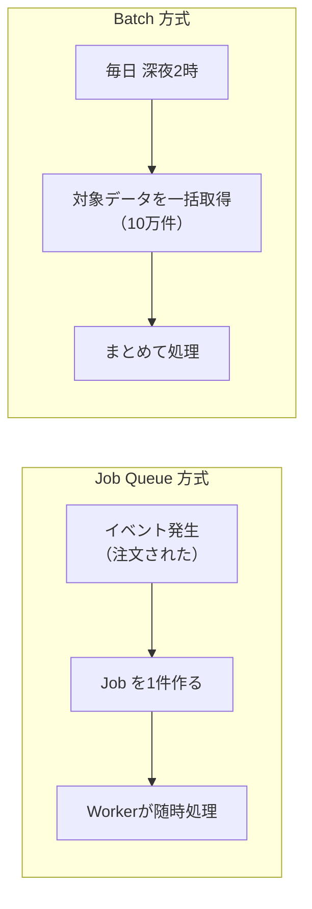

[← 目次に戻る](../../README.md)

# 15. Batchとの違い

「Batch」という言葉も整理しておきましょう。

## 基本イメージ

```text
Job
→ 1つの仕事

Queue
→ 仕事を待たせる仕組み

Worker
→ 仕事を実行する人 / プロセス

Batch
→ 大量のデータや仕事をまとめて処理する方式
```



## ざっくりした違い

| | Job Queue | Batch |
|---|---|---|
| きっかけ | **イベント**（注文された、登録された） | **時刻・スケジュール**（毎日2時） |
| 単位 | 1件ずつ | まとめて大量に |
| タイミング | 発生してすぐ〜数秒 | 決まった時間 |
| 例 | 登録完了メール送信 | 日次売上集計、月次請求書生成 |

## ⚠️ 注意：Batchという言葉は文脈で意味が変わる

> **「Batch = Queueの上位概念」などと断定しないでください。**

「Batch」は、少なくとも次のように異なる意味で使われます。

| 文脈 | 「Batch」の意味 |
|---|---|
| 一般的な運用 | 定時に動く一括処理（バッチ処理、cronジョブ） |
| Spring Batch (Java) | **大量データ処理のためのフレームワーク**。Job / Step / Chunk という独自の構造を持つ |
| DBやAPI | 複数の操作を**1リクエストにまとめること**（バッチINSERT、バッチAPI） |
| 機械学習 | 一度に処理するデータの**まとまり**（バッチサイズ） |
| Laravel | `Bus::batch()` = **複数のJobを1グループとして扱う機能** |

```text
❌「BatchはQueueより大きい概念」
❌「Batch = 夜間バッチのことだけ」
✅「Batchは"まとめて処理する"という考え方。具体的な意味は文脈で変わる」
```

> 💡 **ポイント**
> Job Queue と Batch は**対立するものではなく、組み合わせられます**。
>
> ```text
> 毎日2時にバッチが起動
>      ↓
> 10万件の対象を見つける
>      ↓
> 10万件のJobをQueueに投入   ← Batch が Producer になる
>      ↓
> 20台のWorkerが並列処理
> ```
>
> 実務ではこの「**Batchで作って、Queueで捌く**」構成がよく使われます。

> ⚠️ **注意**
> Spring Batch のように「Job」という言葉を**フレームワーク独自の意味**で使う仕組みもあります。
> （Spring Batch の Job は「複数のStepからなる大きな処理単位」であり、この資料の「1つの仕事」とは粒度が違います）
> **フレームワークの用語を、一般概念としてそのまま断定しない**よう注意してください。

---

| 前 | 目次 | 次 |
|:--|:--:|--:|
| [← 14. 4言語 概念対応表](14-language-comparison.md) | [📖 目次](../../README.md) | [16. 最終まとめ →](16-summary.md) |
