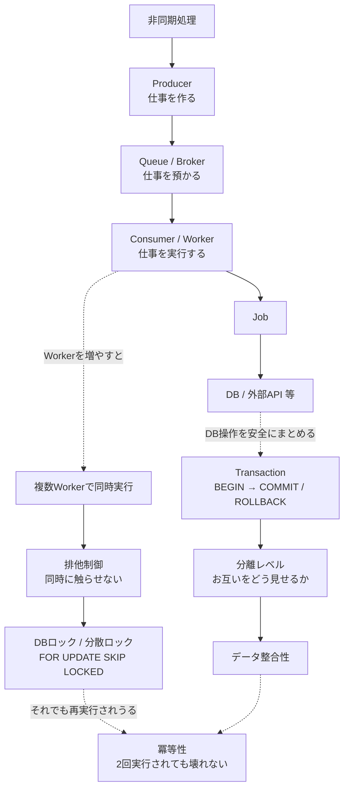
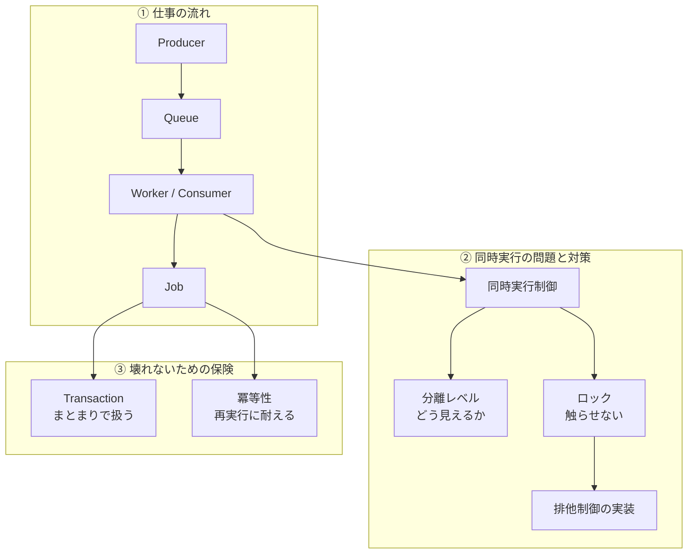

[← 目次に戻る](../../README.md)

# 16. 最終まとめ

## 全体像

```text
                    非同期処理
                        │
                        ↓
                  ┌──────────┐
                  │ Producer │
                  │ 仕事を作る│
                  └────┬─────┘
                       ↓
                ┌──────────────┐
                │ Queue/Broker │
                │ 仕事を預かる │
                └──────┬───────┘
                       ↓
              ┌────────────────┐
              │ Consumer/Worker│
              │ 仕事を実行する │
              └───────┬────────┘
                      ↓
                    Job
                      │
                      ↓
             ┌─────────────────┐
             │ DB / 外部API等  │
             └─────────────────┘

        複数Workerで同時実行
                  ↓
              排他制御
                  ↓
             DBロック等

        DB操作を安全にまとめる
                  ↓
             Transaction
                  ↓
        分離レベル / COMMIT
                  ↓
             データ整合性

        それでも再実行される可能性
                  ↓
               冪等性
```

## Mermaidで見る全体像



## 用語の関係を1枚で




> この資料は「用語を覚える」ためではなく、
> **「Webアプリから仕事が発生して、Queueに入り、Workerが処理する。複数Workerが動いたらどうなる？DBはどう守る？失敗したらどうする？」**
> という**1本のストーリー**として理解するためのものです。
>
> 使っている言語が Python でも Java でも Laravel でも Go でも、
> **考えるべきことは同じ**です。

---

| 前 | 目次 | 次 |
|:--|:--:|--:|
| [← 15. Batchとの違い](15-batch.md) | [📖 目次](../../README.md) | [付録：用語早見表 →](../../appendix/glossary.md) |
